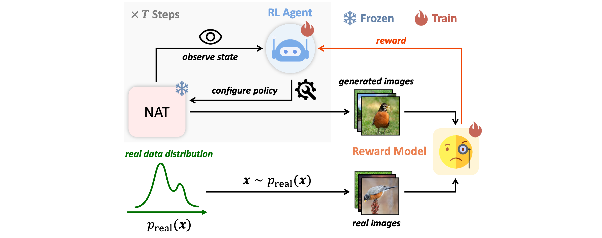

# AdaNAT (ECCV2024)
This repo contains the official PyTorch implementation of [AdaNAT: Exploring Adaptive Policy for Token-Based Image Generation](https://arxiv.org/abs/2409.00342).



## Installation
We support PyTorch>=2.0.0 and torchvision>=0.15.1. Please install them following the official instructions.

Clone this repo and install the required packages:

```shell
git clone https://github.com/LeapLabTHU/AdaNAT
pip install tqdm loguru numpy pandas pyyaml einops omegaconf Pillow accelerate xformers transformers ninja
```

- Prepare FID-stats:
Download the FID-stats from [this link](https://huggingface.co/nzl-thu/MUSE/tree/main/assets/fid_stats) and put it in `assets/fid_stats` directory.

- Prepare pre-trained inception model for FID calculation:
Download the pre-trained inception model from [this link](https://github.com/mseitzer/pytorch-fid/releases/download/fid_weights/pt_inception-2015-12-05-6726825d.pth) and put it in `assets/pt_inception-2015-12-05-6726825d.pth`.

- Prepare pre-trained VQ-tokenizer:
Use [this link](https://drive.google.com/file/d/13S_unB87n6KKuuMdyMnyExW0G1kplTbP/view?usp=sharing) (from [MAGE](https://github.com/LTH14/mage), thanks!) to download the pre-trained VQGAN tokenizer and put it in `assets/vqgan_jax_strongaug.ckpt`.


## Class-conditional Generation on ImageNet-256

### Data preparation

- The ImageNet dataset should be prepared as follows:

```
data
├── train
│   ├── folder 1 (class 1)
│   ├── folder 2 (class 1)
│   ├── ...
```

### Pre-trained Model & Evaluation
Download the pre-trained NAT model from [this link](https://drive.google.com/file/d/12NN62Vg1DiOd-3sWkEnBQRIBBbuiVkNl/view?usp=sharing).
Download the pre-trained policy network from [this link](https://drive.google.com/file/d/1fjHFZUUnEdKptojayW4S1Vr78uwLPr5c/view?usp=sharing).
Then run the following command for evaluation:

```shell
torchrun --nproc_per_node=8 --rdzv_backend=c10d --rdzv_endpoint=localhost:0 train.py \
--data_root /path/of/ImageNet/dataset \
--config configs/imagenet_256_AdaNAT_L.yaml \
--state_dict_path /path/of/pretrained/imagenet/NAT/model \
--eval_paths /path/of/pretrained/policy/network \
--output_dir ./output/imagenet_256
```


### Training the Policy Network
To train the policy network, run the following command:

```shell
torchrun --nproc_per_node=8 --rdzv_backend=c10d --rdzv_endpoint=localhost:0 train.py \
--data_root /path/of/ImageNet/dataset \
--config configs/imagenet_256_AdaNAT_L.yaml \
--state_dict_path /path/of/pretrained/imagenet/NAT/model \
--max_training_timesteps 1000 \
--output_dir ./output/imagenet_256 
```

## Text-to-image Generation on CC3M
### Data preparation

Please refer [CC3M_data_preparation.md](CC3M_data_preparation.md) for data preparation.
After preparing the dataset, the directory structure should be as follows (`cc3m_val.tsv` is under `assets` directory):

```
data
├── cc3m_train.tsv
├── cc3m_val.tsv
```

### Pre-trained Model & Evaluation
Download the pre-trained NAT model from [this link](https://huggingface.co/nzl-thu/MUSE/resolve/main/assets/ckpts/cc3m-285000.ckpt/nnet_ema.pth).
Download the pre-trained policy network from [this link](https://drive.google.com/file/d/1WZ9HxoTifIHhujcgMdBuGt6fwHBDnhG4/view?usp=sharing).
Then run the following command for evaluation:

```shell
torchrun --nproc_per_node=8 --rdzv_backend=c10d --rdzv_endpoint=localhost:0 train.py \
--dset cc3m \
--data_root /path/of/CC3M/dataset \
--config configs/cc3m_AdaNAT_muse.yaml \
--reference_image_path assets/fid_stats/fid_stats_cc3m_val.npz \
--c_dim 1280 \
--state_dict_path /path/of/pretrained/cc3m/NAT/model \
--eval_paths /path/of/pretrained/policy/network \
--n_samples 30000 \
--heu 1 \
--batch_size 64 \
--output_dir ./output/cc3m
```

### Training the Policy Network
To train the policy network, run the following command:

```shell
torchrun --nproc_per_node=8 --rdzv_backend=c10d --rdzv_endpoint=localhost:0 train.py \
--dset cc3m \
--data_root /path/of/CC3M/dataset \
--config configs/cc3m_AdaNAT_muse.yaml \
--reference_image_path assets/fid_stats/fid_stats_cc3m_val.npz \
--c_dim 1280 \
--state_dict_path /path/of/pretrained/cc3m/NAT/model \
--n_samples 30000 \
--heu 1 \
--batch_size 64 \
--output_dir ./output/cc3m \
--max_training_timesteps 150  # early stopping
```

## Citation

If you find our work useful for your research, please consider citing

```
@inproceedings{Ni2024AdaNAT,
  title={AdaNAT: Exploring Adaptive Policy for Token-Based Image Generation.},
  author={Ni, Zanlin and Wang, Yulin and Zhou, Renping and Lu, Rui and Guo, Jiayi and Hu, Jinyi and Liu, Zhiyuan and Yao, Yuan and Huang, Gao},
  booktitle={ECCV},
  year={2024},
}
```

## Acknowledgements

Our implementation is based on
- [U-ViT](https://github.com/baofff/U-ViT) (Network architecture)
- [MaskGIT](https://github.com/google-research/maskgit) (NAT sampling code)
- [MAGE](https://github.com/LTH14/mage?tab=readme-ov-file) (VQGAN weights)
- [VQGAN](https://github.com/CompVis/taming-transformers) (VQGAN code)
- [torch-fidelity](https://github.com/toshas/torch-fidelity) (official implementation of FID and IS in PyTorch)
- [CC3M-Helper](https://github.com/ray-ruisun/CC3M-Helper) (CC3M dataset preparation code)

We thank the authors for their excellent work.

## Contact

If you have any questions, feel free to send mail to [nzl22@mails.tsinghua.edu.cn](mailto:nzl22@mails.tsinghua.edu.cn).
